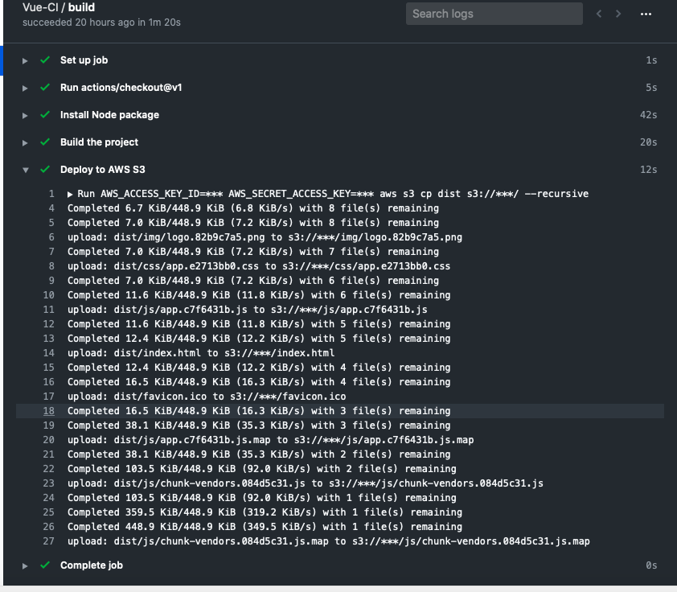

# vue-s3-deployment-workflow

An example workflow that lets you build Vue project and upload build artifact to AWS S3. It helps you build continuous integration (CI) and continuous deployment (CD) capabilities directly in your repository.

### Create AWS Access Key Id and S3 Bucket

> Create an AWS access key - See [Create](https://aws.amazon.com/premiumsupport/knowledge-center/create-access-key/)
and Create AWS S3 Bucket - See [Create S3 Bucket Reference](https://docs.aws.amazon.com/AmazonS3/latest/gsg/CreatingABucket.html)

### Project setup

> Go to Actions tab of your Vue repo and click on "Set up a workflow on yourself" button.

### Add AWS Crdenentails and S3 Bucket name

> Go to Settings tab of your repo amd clik on Secrets button to add AWS_ACCESS_KEY_ID, AWS_SECRET_ACCESS_KEY and S3_BUCKET_NAME.

### Trigger workflow

> Commit any changes to your repo triggers workflow(CI/CD) thats builds and deploys artifacts to AWS S3.

### View Workflow

> Go to Actions tab and click on your workflow to view all the steps it took.

=======

